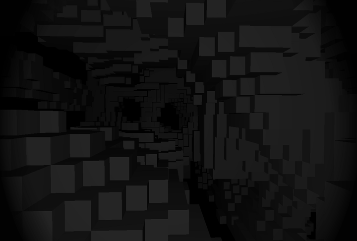

# cavedive
Simple Voxel Engine written in C/OpenGL

<div align="center">
    
</div>

### Requirements
- OpenGL 4.1 or later.
- CMake 3.16 or later.
- GCC, Clang or any compiler that supports C11.

### Warnings.
This program is developed and tested on an Apple M2 device. Other platforms are yet to be tested.

### Compiling

Make sure you have CMake installed in your system.

```console
$> cmake -S . -B build
$> cmake --build build
$> cd build/
```

The produced executable are produced in the build folder.

### Controls
- W: Move Forward.
- A: Move Left.
- S: Move Right.
- D: Move Backward.

- Mouse Movement: Look Around.
- Left Click/Right Click: Remove Blocks.

### Notes
- Removing blocks are still in the works, do not expect for it to work properly.
